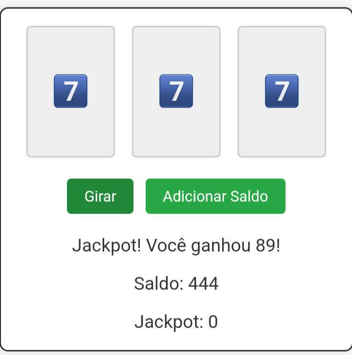

# Slot Machine - Jogo de Caça-Níqueis Simples

Este projeto é uma implementação simples de um jogo de caça-níqueis (slot machine) usando HTML, CSS e JavaScript. A ideia é proporcionar uma introdução prática à construção de jogos básicos para a web. Vamos explorar como ele funciona!

## Estrutura HTML

O código HTML define a estrutura básica do jogo:
- **Cabeçalho (`<head>`):** Configura a codificação de caracteres, a responsividade da página e o título "Slot Machine". Inclui também estilos CSS para deixar o jogo bonito e funcional.
- **Corpo (`<body>`):** Contém o layout do jogo, com três rolos (reels), dois botões (um para girar e outro para adicionar saldo) e áreas para mostrar o resultado, o saldo atual e o jackpot.

## Estilização com CSS

O CSS é utilizado para:
- Centralizar o conteúdo na tela.
- Estilizar a slot machine, incluindo bordas, sombras e animações dos rolos.
- Configurar o visual dos botões e das áreas de texto que mostram informações importantes, como saldo e jackpot.

## Lógica com JavaScript

O JavaScript é responsável por toda a lógica do jogo:
- **Variáveis:** Mantêm o controle do saldo do jogador e do valor acumulado do jackpot.
- **Eventos de Clique:** Respondem aos cliques nos botões de girar e adicionar saldo.
- **Funções:**
  - `spin()`: Gira os rolos, atualiza o saldo e o jackpot, e verifica se houve uma combinação vencedora.
  - `animateReel(reelId, result)`: Gira os rolos com uma animação e mostra os novos símbolos.
  - `checkWin(result1, result2, result3)`: Verifica se os símbolos dos três rolos são iguais e determina se o jogador ganhou ou não.
  - `addSaldo()`: Adiciona saldo ao jogador.

## Como Jogar

1. **Adicionar Saldo:** Clique no botão "Adicionar Saldo" para aumentar seu saldo.
2. **Girar os Rolos:** Clique no botão "Girar" para rodar os rolos. Cada rodada custa 1 de saldo.
3. **Ganhe Prêmios:** Se os símbolos dos três rolos forem iguais, você ganha prêmios em saldo. Se conseguir três símbolos '7️⃣', ganha o jackpot acumulado!
  
